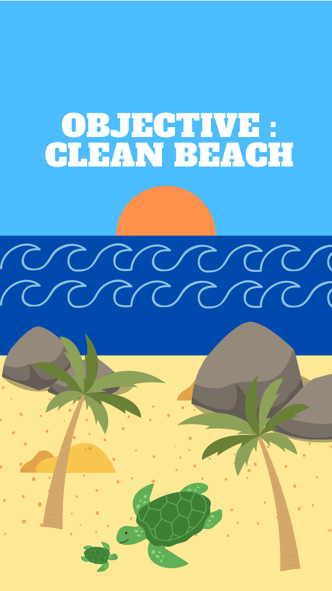

# README.md

# Objective : Clean Beach 🏝

Clean Beach is an NFT project, using Hardhat. It contains the smart contract and it allows the deployment of it on Mumbai network.  The images have been uploaded to Piñata.



## Deploy the project

```jsx
npx hardhat run scripts/deploy.js --network mumbai
```

## See the NFT on OpenSea

To see the minted NFT, follow the link below : [https://testnets.opensea.io/assets/mumbai/0x228a06e0e7b11dccb9960320165ef6affefd2d25/1](https://testnets.opensea.io/assets/mumbai/0x228a06e0e7b11dccb9960320165ef6affefd2d25/1)

## Contributor

@RMARRION, Romain Marrion

@GabrielTruong, Gabriel Truong

@SofiaBmr, Sofia Boumahrat